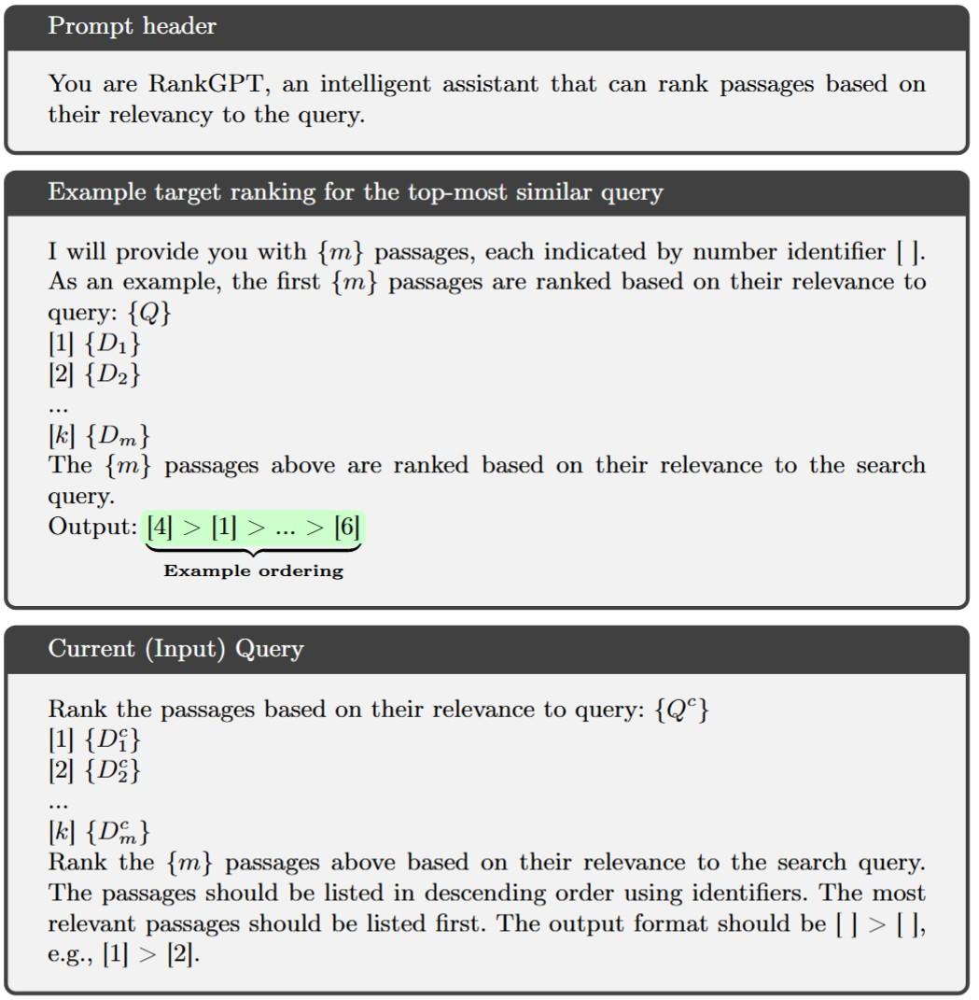

# Additional Experimental Details

## Dataset Description

The fairness task corresponds to that of the `single ranking` task of TREC Fairness track on the `eval` query set. The objective in the Touche task is to mitigate the bias towards a specific stance, whereas the objective in the ad-hoc search task on TREC DL topics is to maximize the topical diversity, where each topic maps to a cluster of documents. We illustrate the details of our chosen collections in Table below.

#### Statistics of the datasets used in our experiments

| Task | Collection | \|𝒞\| | Queries | \|𝒬\| | Name | Values |
| :-- | :-- | :-- | :-- | :-- | :-- | :-- |
| Fairness | TREC Fair | 6.5 M | Fair-2022 | 50 | Gender | M, F |
| Fairness | ToucheV2 | 383 K | Touche'20 | 49 | Stance | PRO, CON |
| Diversity | MS MARCO | 8.8 M | DL'19 | 43 | Topic | ℤ |
| Diversity | MS MARCO | 8.8 M | DL'20 | 54 | Topic | ℤ |

## Clustering for Diversity

To induce topic clusters for diversity evaluation, we apply hierarchical agglomerative clustering with complete linkage over Jaccard similarity between token sets. This is applied to the top 100 documents retrieved per query. Due to the nature of agglomerative clustering, the number of clusters varies with query specificity, resulting in a query-dependent target distribution.

## Query Similarity Retrieval

Following previous work, we retrieve similar queries from the MSMARCO training split using BM25 over query text. We retrieve the top-5 most similar queries and aggregate their retrieved documents to build example sets for in-context learning. No relevance judgments are used in this process.

### Sample Test Query from Touche Dataset

**Query:** Should teachers get tenure?

**Ranking Task:** Rank the passages based on their relevance to query:

- **** ... tenure is needed to **protect academic freedom** (CON) ...
- **** ... without tenure **teachers may be fired** (CON)
- **** ... it is **difficult to remove under-performing teachers** (PRO)

**Instructions:** Rank the 3 passages above based on their relevance to the search query. The passages should be listed in descending order using identifiers. The most relevant passages should be listed first. The output format should be [ ] > [ ], e.g.,  > .

*The figure shows a sample input query from the Touche dataset. The ICL example of a related query from MS MARCO and its example output (balancing both relevance and pro:con parity) is used to control the current query's reranking.*

## LLM Configurations

### Llama-3.1-8B-Instruct

- **Architecture:** 8B decoder-only LLM with 8K context length, sufficient for in-context example ranking
- **Pipeline:** `text-generation` with standard `bfloat16` (recommended for evaluations)
- **Parameters:**
    - `do_sample=True`
    - `temperature=0.6`
    - `top_p=0.9`
    - `seed=42` (for all experiments)
- **Hardware:** Single NVIDIA A100 (40GB) GPU for local experiments

### GPT-4o-mini

- **Usage:** Primary re-ranking model
- **Parameters:**
    - `temperature=0`
    - `return_text=True`
    - `seed=42`
- **Note:** Contamination concerns are minimal since the model is not optimized for improved test scores but for behavioral modulation under auxiliary objectives.

### Llama-3.1-70B-Instruct

- **Architecture:** 70B decoder-only LLM with 8K context length
- **Purpose:** Test behavior of targeted ICL with larger model size
- **Implementation:** API service due to hardware limitations of using the full precision model locally
- **Parameters:** Same as Llama-3.1-8B-Instruct

**Important Note:** We refrain from using rank instruction-tuned models, as these models tend to exhibit greater sensitivity to prompt formatting and catastrophic forgetting of general task knowledge in ICL setups.

# Effect of LLM Variations

We included test results with Llama-70B alongside Llama-8B and GPT-4o-mini to answer if and how our approach is dependent on LLM size. As observed from the results, we mark that GPT-4o-mini consistently outperformed all other models when considering the target task using ICL examples, with the only exception being TREC DL-2020.

Llama-8B results show that our approach works even for small models, but with limited gains both in terms of relevance and auxiliary objective. In contrast to Llama-8B, we observe that Llama-70B is strong in the relevance task; however, it does not show significant improvements in auxiliary objectives with the ICL examples. This suggests that our approach provides limited gains when the model is already superior in terms of diverse rankings. Nevertheless, under settings such as fairness, which are generally detrimental to ranking effectiveness, we can further improve and maintain nDCG.

#### Comparison of LLM Behaviors on Targeted ICL Examples

**The best score across all categories is in bold, and the second-best scores are underlined.**

| Type | Pipeline | nDCG (DL-2019) | α-nDCG (DL-2019) | nDCG (DL-2020) | α-nDCG (DL-2020) | nDCG (Touche-2020) | AWRF (Touche-2020) | M1 (Touche-2020) | nDCG (Fair-2022) | AWRF (Fair-2022) | M1 (Fair-2022) |
| :-- | :-- | --: | --: | --: | --: | --: | --: | --: | --: | --: | --: |
| **Baseline** | BM25 | 0.4795 | 0.4569 | 0.4936 | 0.4895 | 0.2530 | 0.4811 | 0.1851 | 0.4974 | 0.4901 | 0.2975 |
|  | + Llama-8B | 0.5977 | 0.5695 | 0.5971 | 0.6357 | 0.2388 | 0.4821 | 0.1748 | 0.5658 | 0.4895 | 0.3228 |
|  | + Llama-70B | 0.7026 | 0.6441 | 0.6944 | **0.7242** | 0.2400 | 0.4994 | 0.1691 | 0.5742 | 0.5060 | 0.3278 |
|  | + GPT-4o-mini | 0.6971 | 0.6761 | 0.6826 | 0.7039 | 0.2590 | <u>0.5377</u> | <u>0.1936</u> | 0.5688 | <u>0.5494</u> | <u>0.3428</u> |
| **ICL** | + Llama-8B | 0.6144 | 0.5968 | 0.5983 | 0.6062 | 0.2136 | 0.5199 | 0.1486 | 0.5316 | 0.5300 | 0.3159 |
|  | + Llama-70B | 0.6975 | 0.6344 | 0.6906 | 0.6780 | **0.2625** | 0.4981 | 0.1687 | 0.6146 | 0.4910 | <u>0.3428</u> |
|  | + GPT-4o-mini | 0.7124 | 0.7135 | 0.6844 | <u>0.7228</u> | <u>0.2608</u> | **0.5800** | **0.2023** | 0.5697 | **0.5697** | **0.3526** |
| **Baseline** | ColBERT | 0.7205 | 0.6583 | 0.6864 | 0.6385 | 0.2590 | 0.2994 | 0.1462 | 0.4854 | 0.2068 | 0.1204 |
|  | + Llama-8B | 0.7363 | 0.6595 | 0.7044 | 0.6622 | 0.2344 | 0.2588 | 0.1169 | 0.5870 | 0.1247 | 0.0917 |
|  | + Llama-70B | **0.7766** | 0.6788 | 0.7471 | 0.6786 | 0.2347 | 0.2606 | 0.1053 | <u>0.6580</u> | 0.1850 | 0.1313 |
|  | + GPT-4o-mini | <u>0.7699</u> | <u>0.6850</u> | 0.7498 | 0.6843 | 0.2496 | 0.2197 | 0.1027 | 0.6487 | 0.2056 | 0.1466 |
| **ICL** | + Llama-8B | 0.7116 | 0.6527 | 0.6976 | 0.6443 | 0.2089 | 0.2389 | 0.0960 | 0.5183 | 0.2069 | 0.1141 |
|  | + Llama-70B | 0.7621 | 0.6188 | <u>0.7563</u> | 0.6789 | 0.2406 | 0.1995 | 0.0909 | 0.6436 | 0.1822 | 0.1449 |
|  | + GPT-4o-mini | 0.7601 | **0.6891** | **0.7700** | 0.7132 | 0.2508 | 0.2602 | 0.1216 | **0.6606** | 0.2272 | 0.1628 |

# Example Ordering

*Note: The referenced tables (results_iclr) would need to be converted separately from the LaTeX input files.*

We initially adopted random ordering for in-context examples due to its simplicity and computational efficiency. However, prior work highlights that the ordering of both examples and test documents can critically influence model behavior, introducing instability or performance degradation in tasks like ranking and generation. To systematically evaluate this risk, we complement random ordering with examples ordered by first-stage ranker scores (e.g., BM25 or ColBERT relevance scores).

This dual approach tests whether example ordering impacts model outputs analogously to test document ordering—specifically, whether ordered examples provide clearer task conditioning while random ordering acts as a regularizer. By comparing these configurations, we isolate the effect of document ordering on the model's ability to balance relevance and auxiliary objectives.

We observe how a randomly shuffled initial ordering of ICL examples compares to the ordering by the first stage. Intuitively, one can assume that demonstrations should closely match the exact setting in which the model is used. Our results demonstrate that stage-one ordering enhances nDCG but adversely impacts the auxiliary objective performance.

However, we generally observe that random shuffling is robust and contributes positively to the auxiliary objectives. We attribute this to the fact that random ordering mitigates bias and enables the system to generalize effectively across diverse objectives while also enhancing the adaptability of our approach. While document order is a key factor in the robustness of supervised list-wise re-rankers, this appears to have a reduced negative effect on exemplar-based zero-shot list-wise ranking. With likely improvements of supervised rankers in the future, these same improvements may bolster the effectiveness of in-context learning methods.

# Prompt Template
[]

*Note: The referenced figure (icl_template) would need to be converted separately from the LaTeX input file.*

The template shows the format for including the list-wise examples. The sample output labeled as `Example ordering` refers to an ordering - a permutation map of the input - found by maximizing a given objective related to the distribution of the metadata values of each document of the input list ⟨D₁,...,Dₖ⟩ retrieved for the query Q which is similar to Qc (the current input query). This permutation of a set of input documents retrieved for a similar query is the only mechanism to `control` the output ranking for the query Qc.

# Localized Queries used for ICL Examples

*Note: The referenced figure (localized_queries) would need to be converted separately from the LaTeX input file.*

Using BM25, we retrieve five queries for each test query from the MS MARCO train query set. These similar queries are used as the query for ICL examples. Sample examples of such similar queries for each test are shown in the referenced figure.
